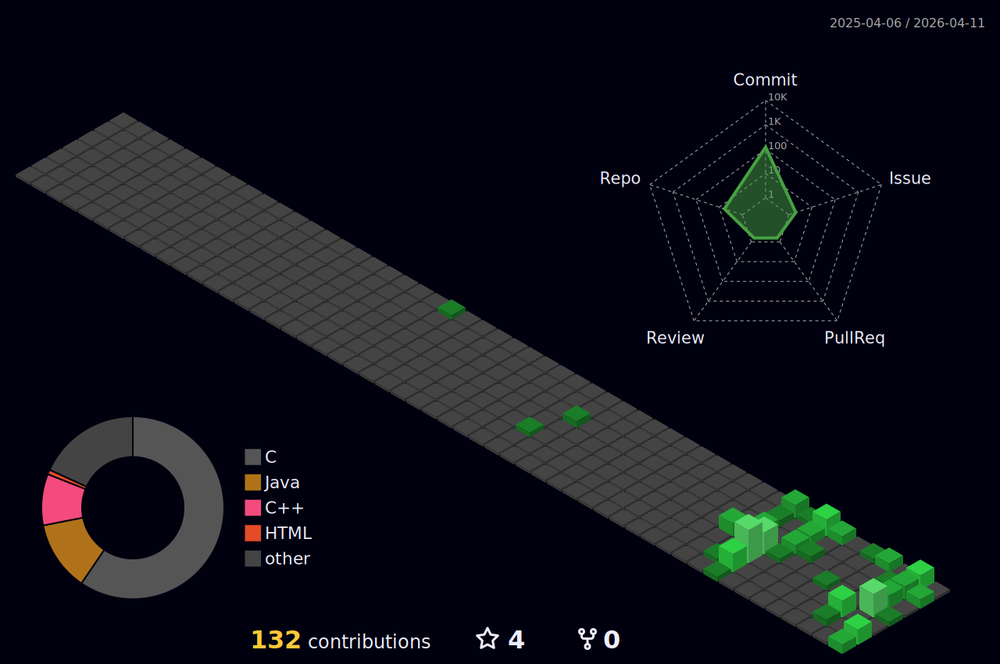

  

 

  

  
  
  
  

---

<table width="100%">
  <tr>
    <td width="60%" valign="top">
      <h3>👨‍💻 About Me</h3>
      <ul>
        <li>🔭 I’m currently building <b>SyntaxFlow</b> and <b>Nord_C</b></li>
        <li>🌱 I’m currently diving deep into <b>Rust, Python, and DSA</b></li>
        <li>👯 I’m looking to collaborate on <b>Open-source C & C++ systems</b></li>
        <li>💬 Ask me about <b>Lower-level architecture & Toolchains</b></li>
        <li>⚡ Fun fact: <i>"Noob mode = TRUE, but constantly compiling out of it"</i></li>
      </ul>
    </td>
    <td width="40%" valign="top" align="center">
      
    </td>
  </tr>
</table>

### Competitive Programming

  

### Languages

<!--  -->

### Technologies

### Projects

---

### 📈 GitHub Analytics

  
  

  
    

   
    

  

    
  

## Stats

---

  

